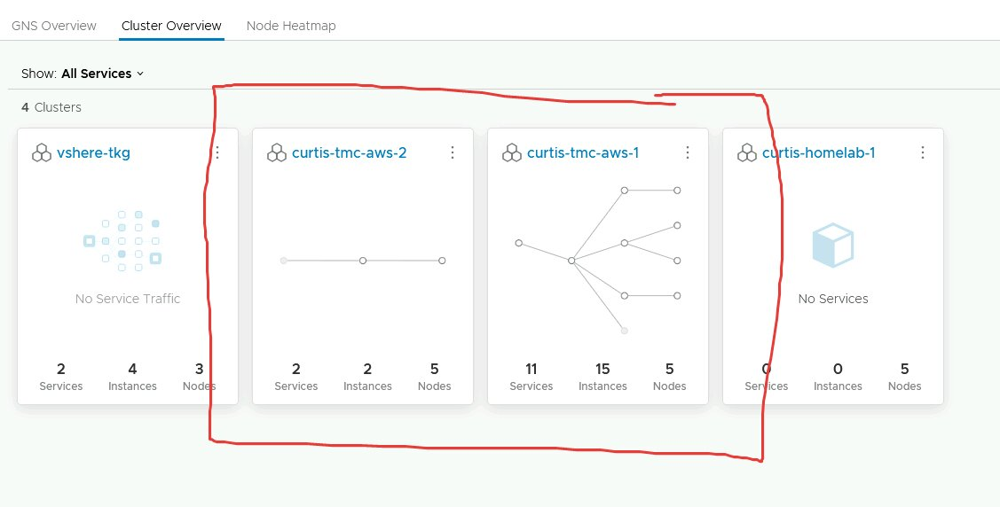
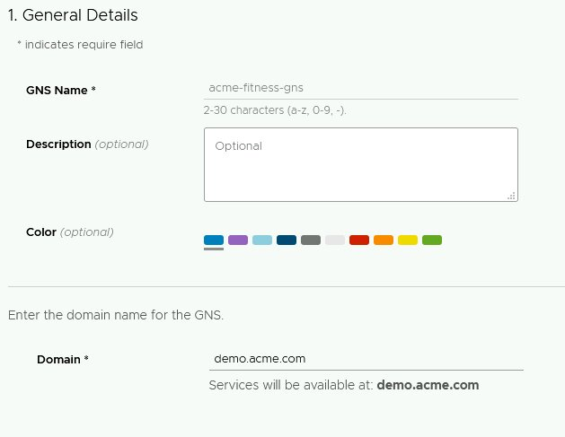
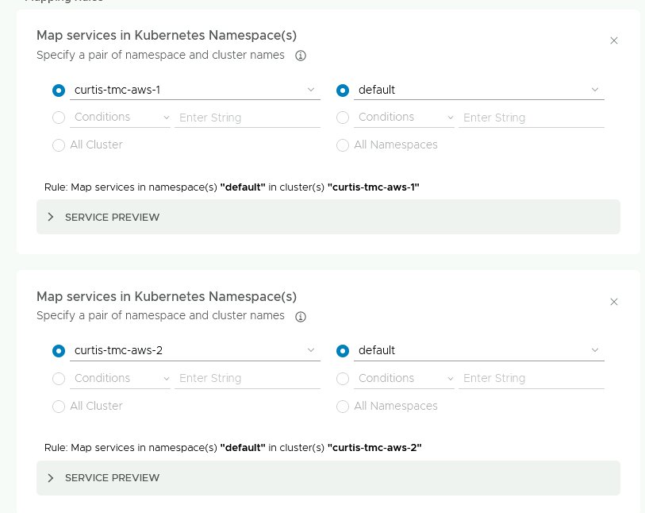
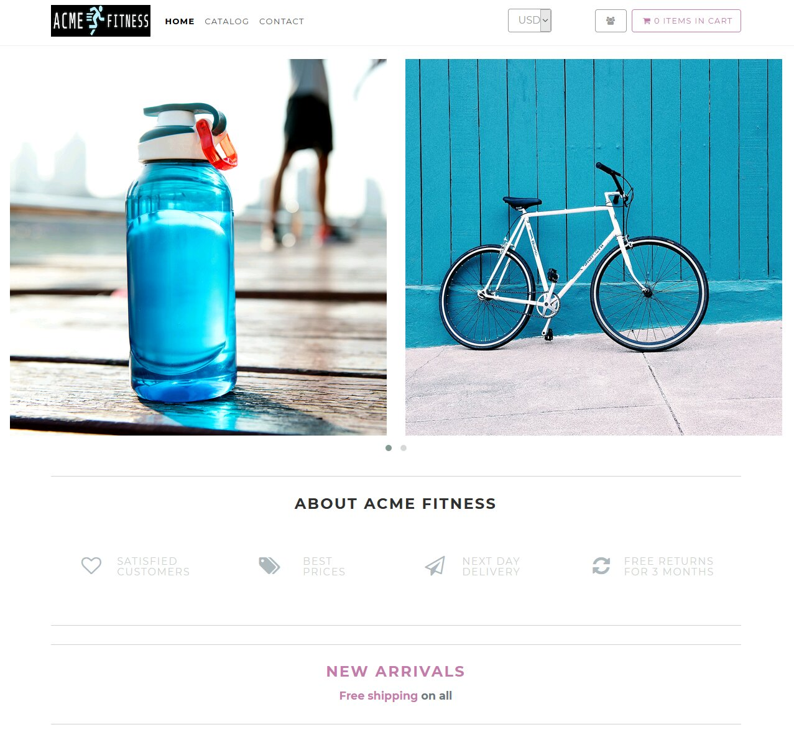
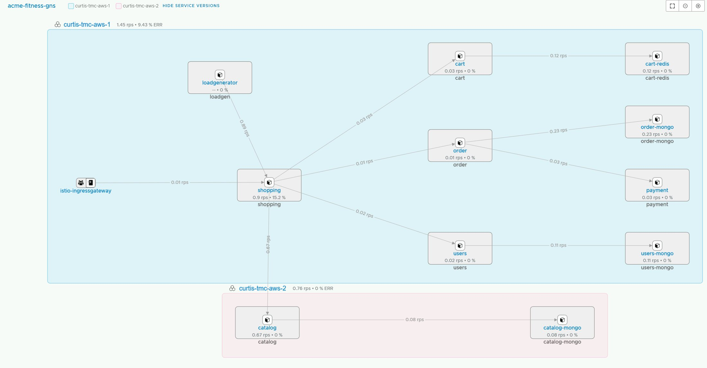

# Tanzu Service Mesh Demo

This is a quick demo of running cross cluster services using [Tanzu Service Mesh](https://tanzu.vmware.com/service-mesh) (TSM).

TSM is extremely powerful because it lets you connect services across clusters easily. So we can have, for example, a microservice run by one team in one Kubernetes cluster talk to another microservice run by another team in another cluster, and neither of the teams has to understand how it works. They can just discover the service based on a global service entry.

Please note the official Acme Fitness repo is [here](https://github.com/vmwarecloudadvocacy/acme_fitness_demo).

## Demo

In this demo we will deploy the Acme Fitness microservice-based polyglot application across two Kubernetes clusters.

The point of this demo is to show how easy it is to connect services across Kubernetes clusters as well as easily configuring mTLS everywhere. Developers won't have to understand how the global service mesh works, just that they can use it to discover services that may exist in many other Kubernetes clusters. Amazing!

### Requirements

* Access to TSM

Talk to your VMware representative to get access to TSM. Also, take a look at [Getting Started with Tanzu Service Mesh](https://docs.vmware.com/en/VMware-Tanzu-Service-Mesh/services/getting-started-guide/GUID-FC2E0065-AC7B-4AEA-944A-2AC4DF2AA789.html).

* Two Kubernetes clusters 

Create two greenfield Kubernetes clusters. They will need to be large enough to run TSM as well as Acme Fitness. An example minimum sizing would be five worker nodes, 2 VCPU and 4GB memory in each node.

### Clusters

In this example, I have two Tanzu Kubernetes Grid clusters created in Amazon Web Services via [Tanzu Mission Control](https://tanzu.vmware.com/mission-control). (Don't worry, most modern conformant Kubernetes clusters should be fine.)

```
$ tmc cluster list | grep curtis
  curtis-aws-1        aws-hosted         curtis-aws-us-east-2-creds  tmc.cloud.vmware.com/creator:ccollicutt  
  curtis-aws-2        aws-hosted         curtis-aws-us-east-2-creds  tmc.cloud.vmware.com/creator:ccollicutt 
```

I've got those loaded into my Kubeconfig.

>NOTE: `kc` is my alias for `kubectx`

```
$ kc
curtis-aws-1
curtis-aws-2
```

### Onboard Kubernetes Clusters to TSM

Onboard the two clusters into TSM. This is straight forward to do through the TSM GUI.

Once they are onboarded they should appear in the `Cluster Overview` tab.

>NOTE: In this screenshot there are existing services, but at this point in the demo, the clusters will not have any services as the Acme Fitness app has not been deployed.



### Create a Global Namespace

Next, create a GNS made up of the two clusters and their `default` namespaces.

Use `demo.acme.com` as the domain in the GNS configuration. Leave everything else as default.



Configure the service mappings across clusters.

>NOTE: In this screenshot, the clusters have been called `curtis-tmc-aws-1,2` which is the `curtis-aws-1,2` cluster....same clusters slightly different names as far as TSM is concerned.



`curtis-aws-1` will be `cluster 1` and `curtis-aws-2` cluster 2.

### Deploy to Cluster 1

Ensure the kubeconfig is pointing to cluster 1.

```
$ kc curtis-aws-1
✔ Switched to context "curtis-aws-1".
```

And deploy the cluster 1 services.

```
kubectl label ns default istio-injection=enabled
kubectl apply -f secrets.yaml
kubectl apply -f gateway.yaml
kubectl apply -f acme-fitness-cluster-1.yaml
```

### Deploy Traffic Generator to Cluster 1

This load generator will create traffic to utilize the application.

```
kubectl apply -f traffic-generator/loadgen.yaml -n default
```
### Deploy to Cluster 2


Switch to the second cluster.

```
$ kc curtis-aws-2
✔ Switched to context "curtis-aws-2".
```

Deploy the second cluster services.

```
kubectl label ns default istio-injection=enabled
kubectl apply -f secrets.yaml
kubectl apply -f gateway.yaml
kubectl apply -f acme-fitness-cluster-2.yaml
```

### Access Acme Fitness

Determine the URL of the istio-ingressgateway.

```
kubectl get svc -n istio-system istio-ingressgateway
```

Access that URL in the browser. Something like the below should be visble.



### Review Service Graph

At this point, it may take a few minutes to show up, there should be a graph that looks like the below in TSM.

Ultimately what this demo has done is tell the shopping service that the catalog service is located at catalog.demo.acme.com, and the underlying networking plubmiing is implemtned by Tanzu Service Mesh, which can be seen in the `acme-fitness-cluster-1.yaml` manifest. 

```
$ grep -A 1 CATALOG_HOST acme-fitness-cluster-1.yaml 
        - name: CATALOG_HOST
          value: 'catalog.demo.acme.com'
```

And that is what is shown on the graph.




### Review Objects Created

We would expect to see the following objects.

```
$ k get serviceentries
NAME                                       HOSTS                             LOCATION        RESOLUTION   AGE
nsxsm.gns.acme-fitness-gns.cart            ["cart.demo.acme.com"]            MESH_INTERNAL   DNS          7m51s
nsxsm.gns.acme-fitness-gns.cart-redis      ["cart-redis.demo.acme.com"]      MESH_INTERNAL   DNS          7m51s
nsxsm.gns.acme-fitness-gns.catalog         ["catalog.demo.acme.com"]         MESH_INTERNAL   DNS          6m51s
nsxsm.gns.acme-fitness-gns.catalog-mongo   ["catalog-mongo.demo.acme.com"]   MESH_INTERNAL   DNS          6m51s
nsxsm.gns.acme-fitness-gns.kubernetes      ["kubernetes.demo.acme.com"]      MESH_INTERNAL   DNS          118m
nsxsm.gns.acme-fitness-gns.loadgen         ["loadgen.demo.acme.com"]         MESH_INTERNAL   DNS          6m51s
nsxsm.gns.acme-fitness-gns.order           ["order.demo.acme.com"]           MESH_INTERNAL   DNS          7m51s
nsxsm.gns.acme-fitness-gns.order-mongo     ["order-mongo.demo.acme.com"]     MESH_INTERNAL   DNS          7m51s
nsxsm.gns.acme-fitness-gns.payment         ["payment.demo.acme.com"]         MESH_INTERNAL   DNS          7m51s
nsxsm.gns.acme-fitness-gns.shopping        ["shopping.demo.acme.com"]        MESH_INTERNAL   DNS          7m51s
nsxsm.gns.acme-fitness-gns.users           ["users.demo.acme.com"]           MESH_INTERNAL   DNS          7m51s
nsxsm.gns.acme-fitness-gns.users-mongo     ["users-mongo.demo.acme.com"]     MESH_INTERNAL   DNS          7m51s

```

```
$ k get virtualservice
NAME                                       GATEWAYS           HOSTS                             AGE
acme                                       ["acme-gateway"]   ["*"]                             11m
nsxsm.gns.acme-fitness-gns.cart                               ["cart.demo.acme.com"]            10m
nsxsm.gns.acme-fitness-gns.cart-redis                         ["cart-redis.demo.acme.com"]      10m
nsxsm.gns.acme-fitness-gns.catalog                            ["catalog.demo.acme.com"]         9m55s
nsxsm.gns.acme-fitness-gns.catalog-mongo                      ["catalog-mongo.demo.acme.com"]   9m55s
nsxsm.gns.acme-fitness-gns.kubernetes                         ["kubernetes.demo.acme.com"]      121m
nsxsm.gns.acme-fitness-gns.loadgen                            ["loadgen.demo.acme.com"]         9m55s
nsxsm.gns.acme-fitness-gns.order                              ["order.demo.acme.com"]           10m
nsxsm.gns.acme-fitness-gns.order-mongo                        ["order-mongo.demo.acme.com"]     10m
nsxsm.gns.acme-fitness-gns.payment                            ["payment.demo.acme.com"]         10m
nsxsm.gns.acme-fitness-gns.shopping                           ["shopping.demo.acme.com"]        10m
nsxsm.gns.acme-fitness-gns.users                              ["users.demo.acme.com"]           10m
nsxsm.gns.acme-fitness-gns.users-mongo                        ["users-mongo.demo.acme.com"]     10m
```

## Conclusion

At this point an Acme Fitness instance has been deployed with services easily connected across two Kubernetes clusters. What's more they are fully connected using mTLS! And no one has to know how the connectivity works, instead just discover services.